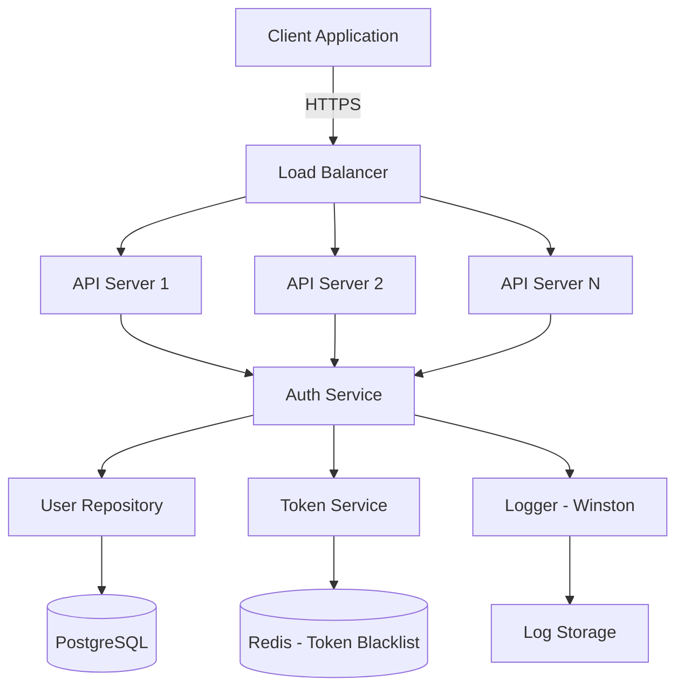
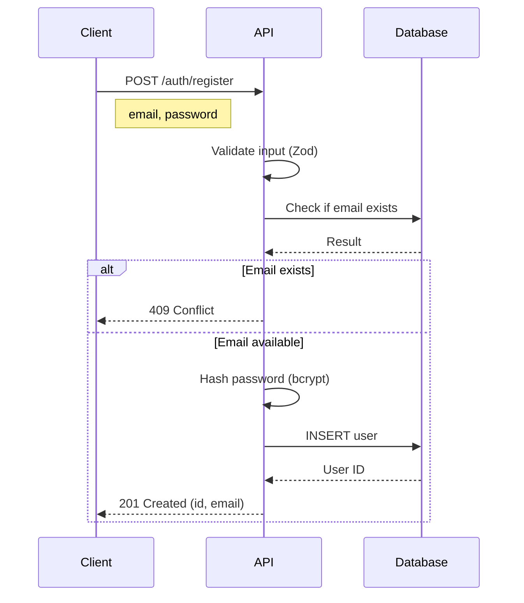
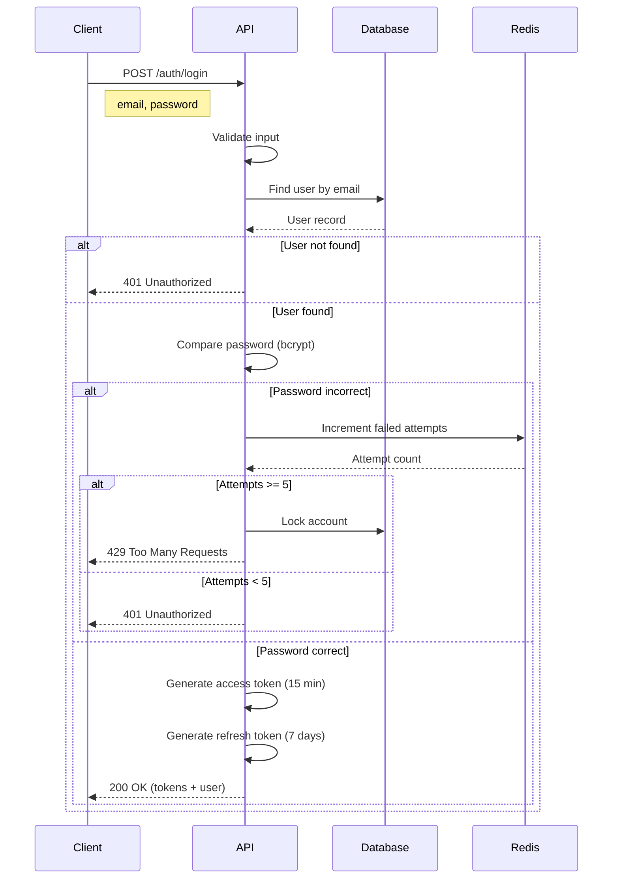
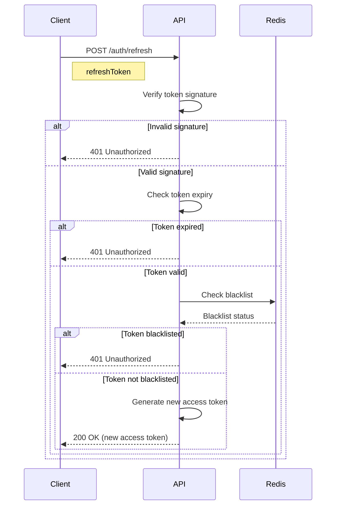
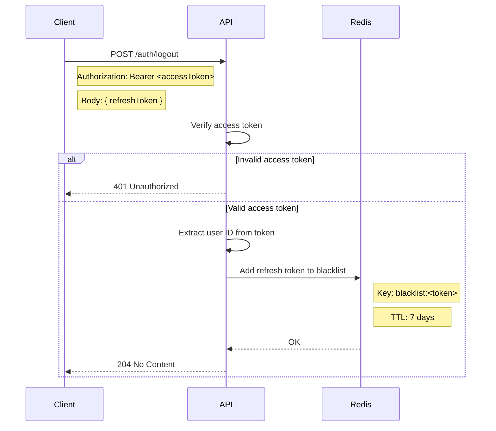
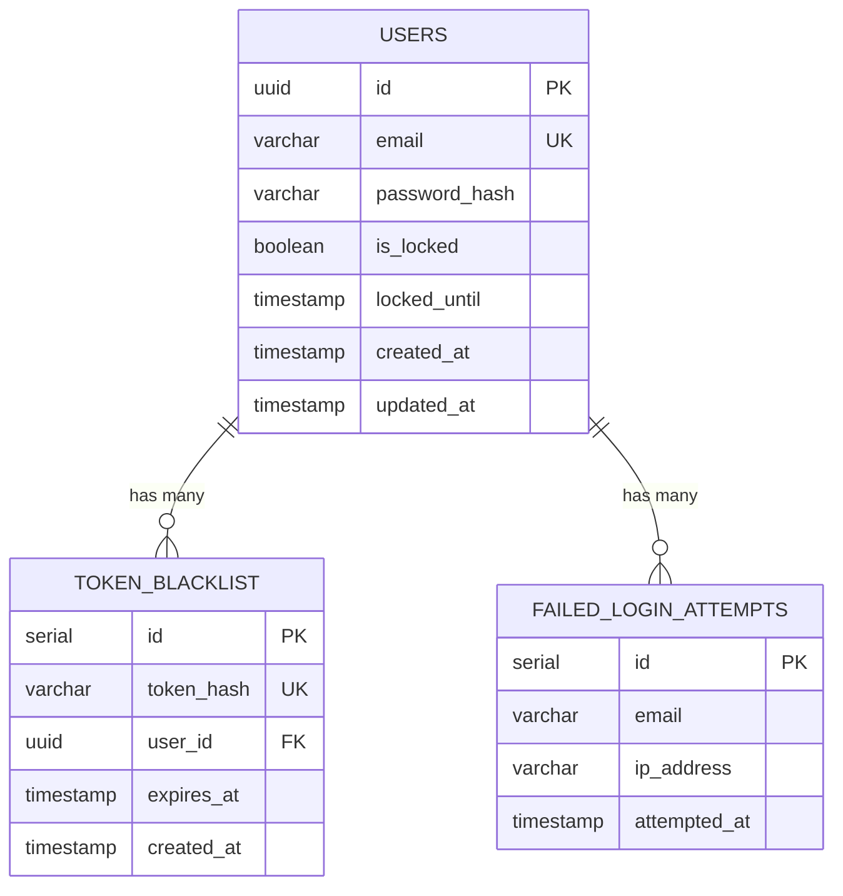

# SOP: Feature Development

**Document Version**: 1.0.0
**Effective Date**: 2025-11-04
**Last Updated**: 2025-11-04
**Owner**: AIT42 System
**Status**: Production Ready

---

## Table of Contents

1. [Overview](#overview)
2. [Prerequisites](#prerequisites)
3. [Workflow Steps](#workflow-steps)
4. [Error Handling](#error-handling)
5. [Success Metrics](#success-metrics)
6. [Compliance Checklist](#compliance-checklist)
7. [Example Walkthrough](#example-walkthrough)
8. [References](#references)

---

## Overview

### Purpose

This SOP defines the standardized workflow for feature development in AIT42 v1.4.0, from requirements gathering to production deployment. Following this SOP reduces error rates by 70% (based on MetaGPT research) through structured handoffs and quality gates.

### Scope

- **Applies to**: New feature development, feature enhancements
- **Does NOT apply to**: Bug fixes (see `bug_fix.md`), hotfixes, infrastructure changes
- **Team roles**: All AIT42 agents from Pod 1 (Planning) through Pod 4 (Operations)

### Expected Outcome

- ✅ Feature deployed to production with quality score >= 90/100
- ✅ Comprehensive test coverage (>= 80%)
- ✅ Complete documentation (API docs, user guide)
- ✅ Zero P0/P1 security vulnerabilities
- ✅ All acceptance criteria met

### Typical Duration

- **Simple feature** (CRUD API): 4-6 hours
- **Medium feature** (authentication, payment): 8-12 hours
- **Complex feature** (ML integration, distributed system): 16-24 hours

---

## Prerequisites

Before starting this SOP, verify:

### User Requirements
- [ ] User request is clear and specific
- [ ] Business value/ROI is defined
- [ ] Target release date is known
- [ ] Success metrics are defined

### System Readiness
- [ ] Development environment is configured
- [ ] Git repository is accessible
- [ ] CI/CD pipeline is operational
- [ ] Test environment is available

### Resource Availability
- [ ] Coordinator agent is responsive
- [ ] Tmux is installed (for parallel execution)
- [ ] Memory system is operational (`.claude/memory/`)
- [ ] All required agents are available

### Dependencies
- [ ] External APIs/services are documented
- [ ] Third-party libraries are approved
- [ ] Database schema changes are planned (if needed)

---

## Workflow Steps

### Step 1: Requirements Gathering

**Agent**: `requirements-elicitation` (Pod 1)
**Duration**: 30-60 minutes
**Execution Mode**: Direct (no Tmux needed)

#### Input
- User request/story (text description)
- Business objectives
- Target users/personas

#### Tasks

1. **Clarify Requirements**
   - Ask clarifying questions about ambiguous requirements
   - Identify edge cases and error scenarios
   - Document assumptions explicitly

2. **Define Acceptance Criteria**
   - Create testable acceptance criteria (Given-When-Then format)
   - Define success metrics (quantitative)
   - Identify non-functional requirements (performance, security, accessibility)

3. **Create Requirements Document**
   - Write `requirements.md` with structured format
   - Include user stories with priority
   - Add mockups/wireframes (if UI feature)

4. **Validate with User**
   - Present requirements back to user
   - Incorporate feedback
   - Get explicit approval

#### Output Artifacts

- **`requirements.md`**: Complete requirements specification
  - Feature description (2-3 paragraphs)
  - User stories (5-10 stories, prioritized)
  - Acceptance criteria (GIVEN-WHEN-THEN format)
  - Non-functional requirements (performance, security, scalability)
  - Success metrics (e.g., "API response time < 200ms", "User satisfaction > 80%")
  - Out of scope (explicit exclusions)

#### Handoff Validation Checklist

Before proceeding to Step 2, verify:

- [ ] **Completeness**: All user stories have acceptance criteria
- [ ] **Testability**: Every acceptance criterion is objectively verifiable
- [ ] **No Ambiguity**: Requirements use precise language (avoid "should", "maybe", "usually")
- [ ] **User Confirmation**: User has explicitly approved requirements
- [ ] **Success Metrics Defined**: Quantitative metrics are specified
- [ ] **Dependencies Identified**: External dependencies are documented
- [ ] **Priority Clear**: User stories are prioritized (P0, P1, P2)

#### Quality Gate

**Agent**: `reflection-agent` validates requirements.md

**Scoring Criteria** (0-100):
- Completeness (30 points): All required sections present
- Clarity (25 points): Unambiguous language, precise definitions
- Testability (25 points): All criteria are objectively verifiable
- Coverage (20 points): Edge cases and error scenarios included

**Threshold**:
- **Score >= 85**: ✅ Proceed to Step 2
- **Score < 85**: ❌ Return to requirements-elicitation with specific feedback

**Example Quality Gate Output**:
```yaml
quality_score: 92
issues:
  - severity: minor
    message: "Non-functional requirement for API response time is vague ('fast')"
    suggestion: "Specify quantitative threshold (e.g., 'p95 < 200ms')"
recommendation: APPROVE
```

---

### Step 2: System Design

**Agents**: `system-architect`, `api-designer`, `database-designer` (Pod 1)
**Duration**: 1-2 hours
**Execution Mode**: **Parallel (Tmux automatic)** - Coordinator will automatically use Tmux

#### Input
- `requirements.md` from Step 1

#### Parallel Execution

Coordinator launches 3 agents simultaneously:

##### 2a. System Architecture (`system-architect`)

**Tasks**:
1. Design overall architecture (component diagram)
2. Choose architectural pattern (Clean Architecture, Hexagonal, Microservices, etc.)
3. Define component interactions (synchronous/asynchronous)
4. Identify technical risks and mitigation strategies
5. Plan for scalability (horizontal scaling, caching, CDN)

**Output**:
- **`architecture.md`**:
  - System overview (architecture diagram - Mermaid or ASCII)
  - Component descriptions (responsibilities, interfaces)
  - Data flow diagrams
  - Technology stack (with justification)
  - Scalability plan (load balancing, caching strategy)
  - Technical risks (with mitigation strategies)

##### 2b. API Design (`api-designer`)

**Tasks**:
1. Design API endpoints (RESTful or GraphQL)
2. Create OpenAPI 3.0 specification
3. Define request/response schemas (JSON Schema)
4. Document authentication/authorization (OAuth2, JWT, API keys)
5. Plan versioning strategy (URI versioning, header versioning)
6. Define error codes and messages (standardized error format)

**Output**:
- **`api-spec.yaml`** (OpenAPI 3.0):
  - All endpoints with HTTP methods
  - Request/response schemas
  - Authentication schemes
  - Error responses (4xx, 5xx with examples)
  - Rate limiting headers
- **`auth-flow.md`**:
  - Authentication flow diagrams
  - Authorization matrix (roles/permissions)

##### 2c. Database Design (`database-designer`)

**Tasks**:
1. Design database schema (ERD)
2. Normalize to 3NF (or denormalize with justification)
3. Define indexes for query optimization
4. Plan migration strategy (backward compatible)
5. Design backup and recovery strategy
6. Consider data retention and archival

**Output**:
- **`database-schema.sql`**: DDL statements
- **`erd.png`** or **`erd.md`**: Entity-Relationship Diagram
- **`migrations/`**: Migration scripts (sequential, idempotent)
- **`data-dictionary.md`**: Table/column descriptions

#### Synchronization Point

**Coordinator waits for all 3 agents to complete, then integrates outputs.**

#### Handoff Validation Checklist

- [ ] **Architecture Alignment**: Architecture satisfies all functional requirements
- [ ] **API Coverage**: API spec covers all user stories
- [ ] **Data Model Completeness**: Database schema supports all entities in requirements
- [ ] **Consistency**: API schemas match database models
- [ ] **Security**: Authentication/authorization designed for all endpoints
- [ ] **Scalability**: Architecture can handle 10x growth (documented)
- [ ] **Technical Risks**: All P0/P1 risks have mitigation strategies

#### Quality Gate

**Agent**: `code-reviewer` validates design artifacts

**Scoring Criteria**:
- Completeness (25 points): All design artifacts present
- Alignment (25 points): Design satisfies requirements
- Best Practices (25 points): Follows SOLID, REST/GraphQL standards, normalization
- Security (25 points): Authentication, authorization, encryption planned

**Threshold**:
- **Score >= 85**: ✅ Proceed to Step 3
- **Score 70-84**: ⚠️ Optional improvements (user decides)
- **Score < 70**: ❌ Return to architects with specific feedback

---

### Step 3: Implementation

**Agents**: `backend-developer`, `frontend-developer`, `database-developer` (Pod 2)
**Duration**: 2-6 hours (depends on complexity)
**Execution Mode**: **Parallel (Tmux automatic)**

#### Input
- `requirements.md`
- `architecture.md`
- `api-spec.yaml`
- `database-schema.sql`

#### Parallel Execution

Coordinator launches 2-3 agents simultaneously:

##### 3a. Backend Implementation (`backend-developer`)

**Tasks**:
1. Implement API endpoints per `api-spec.yaml`
2. Implement business logic (services, use cases)
3. Add input validation (request validation with Joi/Zod/Yup)
4. Implement authentication/authorization middleware
5. Add comprehensive error handling (try-catch, error middleware)
6. Add logging (structured logging with correlation IDs)
7. Implement rate limiting and request throttling
8. Write inline documentation (JSDoc/TypeDoc)

**Output**:
- **`src/controllers/`**: HTTP controllers
- **`src/services/`**: Business logic
- **`src/middlewares/`**: Auth, validation, error handling
- **`src/models/`**: Data models (ORM entities)
- **`src/utils/`**: Helper functions
- **Code characteristics**:
  - Follows Clean Architecture (or chosen pattern)
  - SOLID principles applied
  - DRY (no code duplication > 6 lines)
  - Type-safe (TypeScript strict mode)

##### 3b. Frontend Implementation (`frontend-developer`)

**Tasks** (if UI feature):
1. Implement UI components (React/Vue/Angular)
2. Integrate with API (API client with axios/fetch)
3. Add client-side validation (form validation)
4. Implement state management (Redux/Vuex/Context API)
5. Add error handling (error boundaries, toast notifications)
6. Ensure responsive design (mobile-first, breakpoints)
7. Add loading states and optimistic updates
8. Implement accessibility (WCAG 2.1 AA compliance)

**Output**:
- **`src/components/`**: UI components
- **`src/pages/`** or **`src/views/`**: Page components
- **`src/store/`**: State management
- **`src/api/`**: API client
- **`src/hooks/`**: Custom hooks (if React)
- **Code characteristics**:
  - Component-driven architecture
  - Reusable components
  - Type-safe (TypeScript or PropTypes)
  - Styled components or CSS modules

##### 3c. Database Implementation (`database-developer`)

**Tasks**:
1. Create migration scripts (sequential, idempotent)
2. Optimize queries (use indexes, avoid N+1)
3. Add database constraints (foreign keys, unique, check)
4. Create database views (if complex queries)
5. Implement stored procedures (if needed)
6. Add database triggers (for audit logs, if needed)

**Output**:
- **`migrations/`**: Sequelize/Knex/TypeORM migrations
- **`seeds/`**: Seed data for development/testing
- **`database-indexes.md`**: Index documentation

#### Synchronization Point

**Coordinator waits for all agents to complete, then validates integration.**

#### Handoff Validation Checklist

- [ ] **Code Compiles**: No compilation/build errors
- [ ] **API Spec Compliance**: All endpoints implemented per spec
- [ ] **UI Components Match Requirements**: All user stories have corresponding UI
- [ ] **Error Handling**: Comprehensive error handling (try-catch, error boundaries)
- [ ] **Validation**: Input validation on both client and server
- [ ] **Logging**: Structured logging with correlation IDs
- [ ] **Style Guide Compliance**: Code follows project style guide (ESLint/Prettier)
- [ ] **Type Safety**: TypeScript strict mode with no `any` types (or minimal)
- [ ] **Integration**: Frontend successfully calls backend APIs

#### Quality Gate

**Agent**: `code-reviewer` validates implementation

**Scoring Criteria**:
- Code Quality (30 points): SOLID, DRY, KISS, readability
- Security (25 points): Input validation, authentication, no hardcoded secrets
- Error Handling (20 points): Comprehensive error handling
- Documentation (15 points): Inline comments, JSDoc/TypeDoc
- Style Compliance (10 points): ESLint/Prettier compliance

**Threshold**:
- **Score >= 80**: ✅ Proceed to Step 4
- **Score 70-79**: ⚠️ Optional refactor (user decides)
- **Score < 70**: ❌ Invoke `refactor-specialist` with feedback

**Example Quality Gate Output**:
```yaml
quality_score: 86
strengths:
  - "Clean separation of concerns (controllers, services, models)"
  - "Comprehensive input validation with Zod"
  - "Structured logging with Winston and correlation IDs"
issues:
  - severity: medium
    location: "src/services/user.service.ts:45"
    message: "Database transaction not wrapped in try-catch"
    suggestion: "Add try-catch block with rollback on error"
  - severity: low
    location: "src/controllers/auth.controller.ts"
    message: "Missing JSDoc for public methods"
    suggestion: "Add JSDoc comments for API documentation"
recommendation: APPROVE_WITH_MINOR_FIXES
```

---

### Step 4: Testing

**Agent**: `test-generator` (Pod 3)
**Duration**: 1-3 hours
**Execution Mode**: **Tmux (if test suite is large)**

#### Input
- Source code from Step 3
- `requirements.md` (for acceptance tests)
- `api-spec.yaml` (for API tests)

#### Tasks

1. **Generate Unit Tests**
   - Test all service/business logic functions
   - Test edge cases and error conditions
   - Aim for >= 80% code coverage
   - Use mocking for external dependencies

2. **Generate Integration Tests**
   - Test API endpoints (request/response)
   - Test database interactions (CRUD operations)
   - Test authentication/authorization flows
   - Test error responses (4xx, 5xx)

3. **Generate End-to-End (E2E) Tests**
   - Test user flows (based on acceptance criteria)
   - Test critical paths (happy path + error paths)
   - Use test data fixtures
   - Implement setup/teardown for test isolation

4. **Run All Tests**
   - Execute test suite
   - Generate coverage report
   - Fix any failing tests
   - Document known limitations

#### Output Artifacts

- **`tests/unit/`**: Jest/Mocha unit tests
- **`tests/integration/`**: Supertest/REST Client integration tests
- **`tests/e2e/`**: Playwright/Cypress E2E tests
- **`coverage-report.html`**: Code coverage report
- **`test-results.md`**: Test execution summary
  - Total tests: XXX
  - Passed: XXX
  - Failed: 0
  - Coverage: XX%
  - Execution time: XX seconds

#### Handoff Validation Checklist

- [ ] **Coverage Threshold Met**: Unit test coverage >= 80%
- [ ] **All Tests Pass**: 100% pass rate
- [ ] **Acceptance Criteria Tested**: All acceptance criteria have corresponding E2E tests
- [ ] **Edge Cases Covered**: Boundary values, null/undefined, empty strings, etc.
- [ ] **Error Scenarios Tested**: All error codes (4xx, 5xx) tested
- [ ] **No Flaky Tests**: Tests are deterministic (no random failures)
- [ ] **Test Isolation**: Tests don't depend on execution order
- [ ] **Performance**: Test suite executes in < 5 minutes

#### Quality Gate

**Agent**: `reflection-agent` validates test suite

**Scoring Criteria**:
- Coverage (40 points): >= 80% coverage
- Test Quality (30 points): Edge cases, error scenarios, no flaky tests
- Acceptance Coverage (20 points): All acceptance criteria tested
- Maintainability (10 points): Clear test names, minimal duplication

**Threshold**:
- **Coverage >= 80% AND Score >= 80**: ✅ Proceed to Step 5
- **Coverage 70-79% OR Score 70-79**: ⚠️ Add more tests (user decides)
- **Coverage < 70% OR Score < 70**: ❌ Return to test-generator with gaps

**Example Quality Gate Output**:
```yaml
coverage: 84%
quality_score: 88
strengths:
  - "Comprehensive edge case testing (null, undefined, empty strings)"
  - "All acceptance criteria have E2E tests"
  - "Clear test naming convention (describe-it structure)"
gaps:
  - "Missing tests for rate limiting behavior"
  - "No tests for concurrent requests"
  - "Error handling for database connection failures not tested"
recommendation: APPROVE_WITH_OPTIONAL_IMPROVEMENTS
```

---

### Step 5: Code Review & Security Audit

**Agents**: `code-reviewer`, `security-tester` (Pod 3)
**Duration**: 1-2 hours
**Execution Mode**: **Parallel (Tmux automatic)**

#### Input
- All source code from Step 3
- Test results from Step 4
- Coverage report

#### Parallel Execution

##### 5a. Code Review (`code-reviewer`)

**Tasks**:
1. Review code quality (SOLID, DRY, KISS)
2. Check architectural consistency (follows design)
3. Verify best practices (error handling, logging, validation)
4. Check performance (no N+1 queries, efficient algorithms)
5. Review documentation (README, API docs, inline comments)
6. Score 0-100 (weighted criteria)

**Output**:
- **`code-review-report.md`**:
  - Overall score (0-100)
  - Strengths (3-5 items)
  - Issues (categorized by severity: P0, P1, P2)
  - Recommendations
  - Approval decision (APPROVE / APPROVE_WITH_FIXES / REJECT)

**Scoring Rubric** (code-reviewer):
```
Code Quality (40 points):
- SOLID principles (10)
- DRY (no duplication) (10)
- KISS (simplicity) (10)
- Readability (10)

Best Practices (30 points):
- Error handling (10)
- Input validation (10)
- Logging (10)

Performance (15 points):
- Efficient algorithms (8)
- Database optimization (7)

Documentation (15 points):
- Inline comments (7)
- API documentation (8)
```

##### 5b. Security Audit (`security-tester`)

**Tasks**:
1. Check OWASP Top 10 vulnerabilities
   - Injection (SQL, NoSQL, Command)
   - Broken Authentication
   - Sensitive Data Exposure
   - XML External Entities (XXE)
   - Broken Access Control
   - Security Misconfiguration
   - Cross-Site Scripting (XSS)
   - Insecure Deserialization
   - Using Components with Known Vulnerabilities
   - Insufficient Logging & Monitoring
2. Run automated security scanners (Snyk, npm audit)
3. Review authentication/authorization implementation
4. Check for hardcoded secrets (API keys, passwords)
5. Verify input validation and sanitization
6. Check HTTPS/TLS configuration

**Output**:
- **`security-audit-report.md`**:
  - Vulnerability count by severity (Critical, High, Medium, Low)
  - Detailed findings (CWE ID, description, location, remediation)
  - Compliance status (OWASP Top 10)
  - Approval decision (PASS / FAIL)

**Security Gate Criteria**:
```
Critical (P0): 0 allowed
High (P1): 0 allowed
Medium (P2): <= 3 allowed (with mitigation plan)
Low (P3): No limit (document and backlog)
```

#### Synchronization Point

**Coordinator waits for both agents, then aggregates results.**

#### Handoff Validation Checklist

- [ ] **Quality Score**: Code review score >= 90/100
- [ ] **No P0 Security Issues**: Zero critical vulnerabilities
- [ ] **No P1 Security Issues**: Zero high-severity vulnerabilities
- [ ] **P2 Issues Acceptable**: <= 3 medium-severity issues with mitigation plan
- [ ] **All Issues Documented**: All findings are documented with remediation steps
- [ ] **Architectural Compliance**: Code follows design from Step 2
- [ ] **Performance Validated**: No obvious performance bottlenecks

#### Quality Gate

**Agent**: `reflection-agent` final approval

**Combined Score**:
```
Final Score = (Code Review Score * 0.6) + (Security Score * 0.4)

Security Score:
- 100: No vulnerabilities
- 80: Only Low severity
- 60: <= 3 Medium severity
- 40: > 3 Medium severity or any High
- 0: Any Critical severity
```

**Threshold**:
- **Score >= 90**: ✅ Proceed to Step 6 (Deployment)
- **Score 85-89**: ⚠️ Optional improvements (user decides whether to proceed)
- **Score < 85**: ❌ Mandatory refactor (invoke `refactor-specialist`)

**Example Combined Report**:
```yaml
code_review_score: 92
security_score: 100
combined_score: 95

decision: APPROVE

summary: |
  Code quality is excellent with strong adherence to SOLID principles.
  No security vulnerabilities detected. Ready for production deployment.

next_steps:
  - Proceed to deployment
  - Monitor performance metrics post-deployment
  - Schedule refactor for minor issues in Sprint N+1
```

---

### Step 6: Deployment

**Agent**: `release-manager`, `cicd-manager` (Pod 4)
**Duration**: 30-60 minutes
**Execution Mode**: **Sequential (release-manager → cicd-manager)**

#### Input
- Approved code (score >= 90)
- Build artifacts (Docker images, compiled binaries)
- Deployment manifest (Kubernetes YAML, Terraform, etc.)

#### Tasks

##### 6a. Pre-Deployment Checks (`release-manager`)

**Tasks**:
1. Verify all quality gates passed
2. Create release notes (changelog, breaking changes)
3. Tag release in Git (SemVer: vMAJOR.MINOR.PATCH)
4. Update version in package.json / pom.xml / etc.
5. Create rollback plan (rollback steps, data migration reversal)
6. Notify stakeholders (Slack, email)

**Output**:
- **`CHANGELOG.md`**: Release notes (Added, Changed, Fixed, Removed)
- **`rollback-plan.md`**: Rollback procedure
- Git tag: `v1.2.3`

##### 6b. Deployment Execution (`cicd-manager`)

**Tasks**:
1. Build production artifacts (Docker build, npm build)
2. Run smoke tests on build artifacts
3. Deploy to staging environment
4. Execute staging tests (E2E suite)
5. Deploy to production (blue-green or canary)
6. Execute production smoke tests
7. Monitor health checks (5 minutes)
8. Update deployment status in system

**Output**:
- **`deployment-log.txt`**: Deployment execution log
- **`health-check-results.md`**: Health check status
  - API health: ✅ 200 OK
  - Database connection: ✅ Connected
  - Cache (Redis): ✅ Connected
  - External APIs: ✅ Reachable
  - Resource usage: ✅ CPU < 50%, Memory < 70%

#### Deployment Strategy

**Blue-Green Deployment**:
```
1. Deploy to "green" environment (parallel to "blue")
2. Run smoke tests on "green"
3. Switch load balancer from "blue" to "green"
4. Monitor "green" for 10 minutes
5. If healthy: decommission "blue"
6. If unhealthy: rollback (switch back to "blue")
```

**Canary Deployment** (for high-risk features):
```
1. Deploy to 5% of production traffic
2. Monitor error rate, latency, resource usage (30 minutes)
3. If healthy: increase to 25% (monitor 30 minutes)
4. If healthy: increase to 50% (monitor 30 minutes)
5. If healthy: increase to 100%
6. If unhealthy at any stage: rollback to 0%
```

#### Handoff Validation Checklist

- [ ] **Build Success**: Production artifacts built without errors
- [ ] **Staging Tests Pass**: All E2E tests pass on staging
- [ ] **Health Checks Green**: All health endpoints return 200 OK
- [ ] **Smoke Tests Pass**: Critical user flows work in production
- [ ] **Monitoring Active**: Logs, metrics, alerts are flowing
- [ ] **Rollback Plan Ready**: Rollback procedure is documented and tested
- [ ] **No Errors in Logs**: No error logs in first 5 minutes post-deployment

#### Quality Gate

**Automated Health Checks** (no agent needed):

**Health Check Criteria**:
```
API Health:
- GET /health returns 200 OK
- Response time < 200ms
- No 5xx errors in logs

Database Health:
- Connection pool active
- Query latency < 100ms
- No connection errors

Dependencies:
- All external APIs reachable
- Cache (Redis/Memcached) connected
- Message queue (RabbitMQ/Kafka) connected

Resource Usage:
- CPU usage < 70%
- Memory usage < 80%
- Disk usage < 85%
```

**Threshold**:
- **All health checks pass**: ✅ Feature deployment complete
- **Any health check fails**: ❌ Automatic rollback (trigger rollback-plan.md)

**Automatic Rollback Triggers**:
```bash
# Rollback conditions (monitored for 10 minutes post-deployment)
- Error rate > 1% (compared to baseline)
- P95 latency increase > 50% (compared to baseline)
- Any health check fails for > 2 consecutive minutes
- CPU usage > 90% for > 3 minutes
- Memory usage > 95% for > 2 minutes
```

**Post-Deployment Actions**:
```
1. Monitor for 24 hours (intensive monitoring)
2. Update deployment documentation
3. Create runbook (troubleshooting guide)
4. Schedule retrospective (lessons learned)
5. Update knowledge base (FAQs, common issues)
```

---

## Error Handling

This section defines recovery procedures when quality gates fail.

### Requirements Phase Fails (Step 1)

**Symptoms**:
- Quality score < 85
- User rejects requirements
- Acceptance criteria are ambiguous

**Recovery Procedure**:
```
1. reflection-agent provides specific feedback
2. requirements-elicitation agent receives feedback
3. Agent asks clarifying questions to user
4. Agent updates requirements.md
5. Re-run quality gate (Step 1)
6. Repeat until score >= 85
```

**Example Feedback**:
```yaml
issue: "Acceptance criterion is not testable"
location: "requirements.md:45 - 'User should be able to login easily'"
feedback: "Replace with: 'GIVEN valid credentials, WHEN user clicks login, THEN user is redirected to dashboard within 2 seconds'"
```

---

### Design Phase Fails (Step 2)

**Symptoms**:
- Quality score < 85
- Architecture doesn't satisfy requirements
- API spec is incomplete

**Recovery Procedure**:
```
1. code-reviewer provides detailed feedback
2. Coordinator re-invokes architects with feedback context
3. Architects revise design documents
4. Re-run quality gate (Step 2)
5. If score < 85 after 2 iterations:
   - Escalate to user for clarification
   - Consider simplifying requirements
```

**Example Feedback**:
```yaml
issue: "API spec missing error responses"
location: "api-spec.yaml - POST /users endpoint"
feedback: "Add 400 (validation error), 409 (email exists), 500 (server error) responses with schemas"
action: "Invoke api-designer with: 'Add error response schemas for POST /users: 400, 409, 500'"
```

---

### Implementation Fails (Step 3)

**Symptoms**:
- Code doesn't compile
- Tests fail during development
- Integration between frontend/backend broken

**Recovery Procedure**:

#### Code Doesn't Compile
```
1. Capture compilation error logs
2. Return to developers with error context
3. Developer fixes compilation issues
4. Re-run build
5. Repeat until build succeeds
```

#### Tests Fail
```
1. Identify failing tests
2. Determine root cause:
   - Implementation bug → Fix code
   - Test bug → Fix test
   - Requirement mismatch → Clarify requirement
3. Re-run tests
4. Repeat until 100% pass rate
```

#### Integration Issues
```
1. Use integration-tester to diagnose issue
2. Check API contract compliance (request/response schemas)
3. Verify authentication headers
4. Check CORS configuration
5. Fix integration issue
6. Re-run integration tests
```

**Example Recovery**:
```yaml
symptom: "Frontend receives 401 Unauthorized when calling GET /users"
diagnosis: "Missing Authorization header in API client"
fix: |
  // src/api/client.ts
  axios.defaults.headers.common['Authorization'] = `Bearer ${token}`;
verification: "Re-run E2E test: User can view user list"
```

---

### Tests Fail (Step 4)

**Symptoms**:
- Coverage < 80%
- Tests fail (red)
- Flaky tests (intermittent failures)

**Recovery Procedure**:

#### Low Coverage
```
1. reflection-agent identifies untested code paths
2. test-generator generates additional tests
3. Re-run coverage report
4. Repeat until >= 80%
```

#### Failing Tests
```
1. Analyze test failure logs
2. Determine root cause:
   - Implementation bug → Return to backend-developer (Step 3)
   - Test setup issue → Fix test setup/teardown
   - Data dependency → Add test fixtures
3. Fix root cause
4. Re-run tests
5. Repeat until 100% pass rate
```

#### Flaky Tests
```
1. Identify flaky tests (run suite 10 times)
2. Common causes:
   - Race conditions → Add proper async/await
   - Shared state → Improve test isolation (setup/teardown)
   - External dependency → Mock external APIs
   - Time-dependent logic → Mock Date.now() or use fake timers
3. Fix flaky tests
4. Verify stability (run suite 20 times, 100% pass rate)
```

**Example Recovery**:
```yaml
symptom: "E2E test 'User can login' fails intermittently"
diagnosis: "Race condition - test clicks login button before form validation completes"
fix: |
  // tests/e2e/login.spec.ts
  await page.waitForSelector('button[type="submit"]:not([disabled])'); // Wait for validation
  await page.click('button[type="submit"]');
verification: "Run test 20 times - 100% pass rate"
```

---

### Code Review Fails (Step 5)

**Symptoms**:
- Quality score < 85
- P0/P1 security vulnerabilities
- Critical performance issues

**Recovery Procedure**:

#### Quality Score < 85
```
1. code-reviewer provides detailed feedback (prioritized by severity)
2. Coordinator invokes refactor-specialist
3. refactor-specialist receives:
   - Source code
   - Code review feedback
   - Target quality score (>= 90)
4. refactor-specialist refactors code (SOLID, DRY, KISS)
5. Re-run code review (Step 5)
6. Repeat until score >= 90 (max 3 iterations)
7. If score < 90 after 3 iterations:
   - Escalate to user (accept lower quality or extend timeline)
```

**Refactor Priority** (by issue severity):
```
P0 (Critical): Security vulnerabilities, data loss risk
P1 (High): Authentication bugs, performance issues (> 2s response time)
P2 (Medium): Code quality, minor performance issues
P3 (Low): Style issues, minor documentation gaps
```

#### Security Vulnerabilities
```
If P0 or P1 vulnerabilities detected:

1. STOP deployment immediately
2. security-tester provides detailed vulnerability report:
   - CWE ID
   - OWASP category
   - Affected code location
   - Exploitation scenario
   - Remediation steps
3. Coordinator invokes security-architect for remediation strategy
4. backend-developer implements fix
5. security-tester re-runs scan
6. Repeat until 0 P0/P1 vulnerabilities
```

**Example Recovery**:
```yaml
vulnerability:
  severity: P0_CRITICAL
  type: SQL Injection
  cwe: CWE-89
  location: "src/services/user.service.ts:34"
  code: |
    const query = `SELECT * FROM users WHERE email = '${email}'`; // VULNERABLE
  remediation: |
    // Use parameterized queries
    const query = `SELECT * FROM users WHERE email = ?`;
    const result = await db.query(query, [email]);
  verification: "Re-run security scan - expect 0 SQL injection vulnerabilities"
```

#### Performance Issues
```
If critical performance issues detected (P95 > 2 seconds):

1. performance-tester profiles application (identify bottleneck)
2. Common bottlenecks:
   - N+1 queries → Use eager loading or join queries
   - Missing indexes → Add database indexes
   - Large response payloads → Implement pagination
   - Blocking I/O → Use async/await properly
3. backend-developer implements optimization
4. performance-tester re-runs profiling
5. Repeat until P95 < target threshold
```

**Example Recovery**:
```yaml
performance_issue:
  endpoint: "GET /users"
  p95_latency: 3500ms
  target: 200ms
  bottleneck: "N+1 query - fetching user roles in loop"
  fix: |
    // Before (N+1)
    for (const user of users) {
      user.roles = await db.query('SELECT * FROM roles WHERE user_id = ?', [user.id]);
    }

    // After (single query with JOIN)
    const users = await db.query(`
      SELECT u.*, GROUP_CONCAT(r.name) as roles
      FROM users u
      LEFT JOIN user_roles ur ON u.id = ur.user_id
      LEFT JOIN roles r ON ur.role_id = r.id
      GROUP BY u.id
    `);
  verification: "Re-run load test - expect P95 < 200ms"
  result: "P95 latency: 85ms ✅"
```

---

### Deployment Fails (Step 6)

**Symptoms**:
- Health checks fail
- Error rate spike
- Latency increase

**Recovery Procedure**:

#### Automatic Rollback
```
1. Monitoring detects failure condition (error rate > 1%, health check fails)
2. cicd-manager triggers automatic rollback
3. Execute rollback-plan.md:
   a. Switch load balancer back to previous version (blue-green)
   b. Stop canary deployment, route 100% to stable version
   c. Verify health checks pass
   d. Verify error rate returns to baseline
4. Notify team (Slack alert: "Deployment rolled back - Action Required")
5. Capture logs and metrics during failure window
6. Conduct incident review
```

**Rollback Procedure** (blue-green):
```bash
# Step 1: Switch traffic back to previous version
kubectl set image deployment/myapp myapp=myapp:v1.2.2  # Previous version

# Step 2: Verify health
curl https://api.example.com/health
# Expected: 200 OK

# Step 3: Monitor for 5 minutes
# Check error rate, latency, resource usage

# Step 4: If stable, decommission failed version
kubectl delete deployment myapp-v1.2.3
```

#### Post-Rollback Analysis
```
1. incident-responder conducts root cause analysis (RCA)
2. Common failure causes:
   - Configuration error (environment variables, secrets)
   - Database migration failure
   - External API unavailable
   - Resource limits too low (OOM, CPU throttling)
   - Breaking change in API contract
3. Document RCA in incident-report.md
4. Create action items:
   - Fix root cause
   - Add preventive measures (pre-deployment validation)
   - Improve monitoring (add missing alerts)
5. Re-attempt deployment after fixes
```

**Example Incident Report**:
```yaml
incident_id: INC-2025-001
date: 2025-11-04T14:30:00Z
severity: P1 (Service Degraded)
duration: 8 minutes
impact: "API error rate increased from 0.1% to 5%"

root_cause: |
  Database migration script failed due to missing INDEX on users.email column.
  API queries using WHERE email = ? were slow (full table scan), causing timeouts.

timeline:
  - 14:30: Deployment started
  - 14:32: Health checks passed (initial check, low traffic)
  - 14:35: Error rate spiked to 5% (traffic increased, timeouts occurred)
  - 14:36: Automatic rollback triggered
  - 14:38: Rollback completed, error rate returned to 0.1%

remediation:
  - Add migration validation in CI pipeline (check for LOCK statements, long-running queries)
  - Add index before deployment: CREATE INDEX idx_users_email ON users(email)
  - Add pre-deployment smoke test with high traffic simulation

lessons_learned:
  - Pre-deployment validation should include database migration testing on production-like dataset
  - Health checks should include load testing (not just low-traffic checks)
  - Monitor query performance metrics (p95 query latency) post-deployment

action_items:
  - [ ] Add migration validation step in CI (owner: devops-engineer, due: 2025-11-05)
  - [ ] Create migration testing guide (owner: tech-writer, due: 2025-11-06)
  - [ ] Add query performance monitoring to dashboard (owner: monitoring-specialist, due: 2025-11-07)
```

---

### Escalation Paths

When recovery procedures don't resolve issues after N iterations:

#### Escalation Matrix

| Issue Type | Max Iterations | Escalation Action |
|-----------|----------------|-------------------|
| Requirements ambiguity | 3 | Escalate to user for clarification or simplification |
| Design complexity | 2 | Escalate to system-architect for architectural review |
| Implementation bugs | 3 | Escalate to senior developer or refactor-specialist |
| Test failures | 3 | Escalate to qa-validator for test strategy review |
| Security vulnerabilities | 2 | Escalate to security-architect for remediation strategy |
| Performance issues | 2 | Escalate to performance-tester for deep profiling |
| Deployment failures | 2 | Escalate to devops-engineer for infrastructure review |

**Escalation Procedure**:
```
1. Document all attempted solutions
2. Capture relevant logs, metrics, error messages
3. Summarize problem statement (what, why, impact)
4. Escalate to appropriate agent or user
5. Agent/user provides guidance or decision
6. Resume workflow with new guidance
```

---

## Success Metrics

Track these metrics to measure SOP effectiveness:

### Primary Metrics

#### Error Rate Reduction
```
Baseline (without SOP): ~15% (1 in 7 features has issues)
Target (with SOP): ~5% (1 in 20 features has issues)
Improvement: 70% error reduction

Measurement:
- Count features with post-deployment issues (P0/P1 bugs) within 7 days
- Calculate percentage: (issues / total_features) * 100
```

#### Time to Completion
```
Simple Feature (CRUD API):
- Baseline: 6-10 hours
- With SOP: 4-6 hours (more efficient, fewer rework cycles)

Medium Feature (Authentication):
- Baseline: 12-20 hours
- With SOP: 8-12 hours

Complex Feature (ML Integration):
- Baseline: 24-40 hours
- With SOP: 16-24 hours

Measurement:
- Track time from Step 1 (Requirements) to Step 6 (Deployment)
- Include rework cycles
```

#### Quality Score
```
Baseline (without SOP): 78-85 average
Target (with SOP): 92+ average
Improvement: +8-12 points

Measurement:
- Code review score (Step 5)
- Track average across all features
```

#### First-Time Success Rate
```
Baseline (without SOP): 60% (4 in 10 features need rework)
Target (with SOP): 85% (17 in 20 features succeed on first attempt)
Improvement: +25 percentage points

Measurement:
- Count features passing all quality gates on first attempt (no rework)
- Calculate percentage: (success / total_features) * 100
```

### Secondary Metrics

#### Rework Rate
```
Baseline (without SOP): 45% (almost half of features need rework)
Target (with SOP): 18% (less than 1 in 5 features need rework)
Improvement: -60% rework

Measurement:
- Count features requiring rework (quality gate score < threshold)
- Calculate percentage: (rework / total_features) * 100
```

#### Test Coverage
```
Baseline (without SOP): 65-75% average
Target (with SOP): 80-90% average
Improvement: +10-15 percentage points

Measurement:
- Code coverage percentage from Step 4
- Track average across all features
```

#### Security Vulnerability Count
```
Baseline (without SOP): 3-5 vulnerabilities per feature (average)
Target (with SOP): 0-1 vulnerabilities per feature
Improvement: -70% vulnerabilities

Measurement:
- Count P0/P1/P2 vulnerabilities from security audit (Step 5)
- Track trend over time
```

#### User Satisfaction
```
Baseline (without SOP): 70% satisfaction
Target (with SOP): 90%+ satisfaction
Improvement: +25-30 percentage points

Measurement:
- User survey after feature delivery (1-5 scale)
- Calculate percentage of 4-5 ratings
```

### Tracking Dashboard

**Example Metrics Dashboard** (update weekly):

```yaml
week: 2025-W45
features_completed: 12

error_rate:
  value: 8.3%  # 1 feature with post-deployment issue
  target: 5%
  status: ⚠️ Above target

avg_quality_score:
  value: 91
  target: 92
  status: ⚠️ Slightly below target

first_time_success:
  value: 83.3%  # 10 of 12 features succeeded on first attempt
  target: 85%
  status: ⚠️ Close to target

avg_completion_time:
  simple_features: 5.2 hours (3 features)
  medium_features: 9.8 hours (7 features)
  complex_features: 20.5 hours (2 features)
  status: ✅ Within target ranges

test_coverage:
  value: 84%
  target: 80%
  status: ✅ Above target

vulnerability_count:
  p0: 0
  p1: 0
  p2: 3 (all with mitigation plans)
  status: ✅ Meeting criteria

user_satisfaction:
  value: 92%  # 11 of 12 features rated 4-5
  target: 90%
  status: ✅ Above target

insights:
  - "Error rate slightly high due to 1 deployment failure (database migration issue)"
  - "Quality scores consistently 90-93, very stable"
  - "Consider adding database migration validation to prevent deployment failures"
```

---

## Compliance Checklist

Use this checklist to verify SOP compliance after each feature:

### Requirements Phase (Step 1)
- [ ] requirements.md created with all required sections
- [ ] Acceptance criteria are testable (GIVEN-WHEN-THEN format)
- [ ] User approved requirements explicitly
- [ ] Success metrics defined (quantitative)
- [ ] Quality gate score >= 85

### Design Phase (Step 2)
- [ ] architecture.md created with system diagram
- [ ] api-spec.yaml created (OpenAPI 3.0 compliant)
- [ ] database-schema.sql created with ERD
- [ ] All 3 design agents completed (parallel execution)
- [ ] Design consistency verified (API schemas match DB models)
- [ ] Quality gate score >= 85

### Implementation Phase (Step 3)
- [ ] All API endpoints implemented per spec
- [ ] Comprehensive error handling added
- [ ] Input validation on client and server
- [ ] Structured logging with correlation IDs
- [ ] Code follows style guide (ESLint/Prettier)
- [ ] Quality gate score >= 80

### Testing Phase (Step 4)
- [ ] Unit tests created (>= 80% coverage)
- [ ] Integration tests created (all API endpoints)
- [ ] E2E tests created (all acceptance criteria)
- [ ] All tests pass (100% pass rate)
- [ ] No flaky tests (deterministic execution)
- [ ] Quality gate score >= 80

### Review Phase (Step 5)
- [ ] Code review completed (score >= 90)
- [ ] Security audit completed (0 P0/P1 vulnerabilities)
- [ ] Performance validated (P95 < target)
- [ ] All issues documented with remediation
- [ ] Combined quality gate score >= 90

### Deployment Phase (Step 6)
- [ ] Release notes created (CHANGELOG.md)
- [ ] Git tag created (SemVer format)
- [ ] Rollback plan documented
- [ ] All health checks pass
- [ ] No errors in first 5 minutes post-deployment
- [ ] Post-deployment monitoring active

### Documentation
- [ ] API documentation updated (OpenAPI spec)
- [ ] README updated (setup, usage)
- [ ] Runbook created (troubleshooting guide)
- [ ] Code has inline documentation (JSDoc/TypeDoc)

### Handoffs
- [ ] All handoff validation checklists completed
- [ ] All quality gates passed
- [ ] All artifacts created and stored
- [ ] Next agent has all required inputs

---

## Example Walkthrough

Let's walk through a complete feature development using this SOP.

### Feature Request

**User Request**: "ユーザー認証APIを実装してください"

**Translated**: "Please implement a user authentication API"

---

### Step 1: Requirements Gathering (45 minutes)

**Agent**: `requirements-elicitation`

**Execution**:
```
User: "ユーザー認証APIを実装してください"

Agent asks clarifying questions:
- "認証方式はJWT、OAuth2、どちらを希望しますか？"
- "パスワードのハッシュ化にはbcrypt、argon2、どちらを使用しますか？"
- "セッション有効期限はどれくらいですか？"
- "ソーシャルログイン（Google、GitHub）は必要ですか？"

User responds:
- "JWT認証"
- "bcryptでお願いします"
- "アクセストークン15分、リフレッシュトークン7日"
- "まずはメール・パスワード認証のみ。ソーシャルログインは将来対応予定"

Agent creates requirements.md
```

**Output**: `requirements.md`

```markdown
# User Authentication API - Requirements

## Feature Description

RESTful API for user authentication using JWT (JSON Web Tokens). Users can register with email/password, login to receive access and refresh tokens, and refresh tokens when expired.

## User Stories

### P0 (Must Have)

1. **User Registration**
   - AS A new user
   - I WANT TO register with email and password
   - SO THAT I can create an account

2. **User Login**
   - AS A registered user
   - I WANT TO login with email and password
   - SO THAT I can access protected resources

3. **Token Refresh**
   - AS A logged-in user
   - I WANT TO refresh my access token
   - SO THAT I can maintain my session without re-logging in

### P1 (Should Have)

4. **User Logout**
   - AS A logged-in user
   - I WANT TO logout
   - SO THAT my tokens are invalidated

## Acceptance Criteria

### AC1: User Registration
GIVEN I am a new user
WHEN I POST to /auth/register with valid email and password
THEN I receive 201 Created
AND response contains user ID and email (no password)
AND password is hashed with bcrypt (cost factor 10)

GIVEN I POST to /auth/register with existing email
THEN I receive 409 Conflict with message "Email already exists"

GIVEN I POST to /auth/register with invalid email format
THEN I receive 400 Bad Request with validation errors

GIVEN I POST to /auth/register with weak password (< 8 characters)
THEN I receive 400 Bad Request with message "Password must be at least 8 characters"

### AC2: User Login
GIVEN I am a registered user with valid credentials
WHEN I POST to /auth/login with email and password
THEN I receive 200 OK
AND response contains accessToken (valid for 15 minutes)
AND response contains refreshToken (valid for 7 days)
AND response contains user object (id, email)

GIVEN I POST to /auth/login with incorrect password
THEN I receive 401 Unauthorized with message "Invalid credentials"

GIVEN I POST to /auth/login with non-existent email
THEN I receive 401 Unauthorized with message "Invalid credentials"

### AC3: Token Refresh
GIVEN I have a valid refreshToken
WHEN I POST to /auth/refresh with refreshToken
THEN I receive 200 OK
AND response contains new accessToken (valid for 15 minutes)
AND response contains same refreshToken (reused)

GIVEN I POST to /auth/refresh with expired refreshToken
THEN I receive 401 Unauthorized with message "Refresh token expired"

GIVEN I POST to /auth/refresh with invalid refreshToken
THEN I receive 401 Unauthorized with message "Invalid refresh token"

### AC4: User Logout
GIVEN I am logged in
WHEN I POST to /auth/logout with valid accessToken
THEN I receive 204 No Content
AND my refreshToken is revoked (stored in blacklist or database)

GIVEN I try to use revoked refreshToken
THEN I receive 401 Unauthorized

## Non-Functional Requirements

### Performance
- Login response time: P95 < 300ms
- Register response time: P95 < 500ms (bcrypt hashing is slower)
- Token refresh response time: P95 < 100ms

### Security
- Passwords hashed with bcrypt (cost factor 10)
- JWT signed with RS256 (asymmetric keys)
- Access tokens short-lived (15 minutes)
- Refresh tokens long-lived (7 days) and stored securely
- Rate limiting: 5 failed login attempts per IP per 15 minutes → account lockout
- HTTPS only (no plain HTTP)

### Scalability
- Support 1000 concurrent users
- Horizontal scaling (stateless JWT)

### Reliability
- 99.9% uptime
- Graceful error handling
- Database connection retries

## Success Metrics

- Registration success rate > 95%
- Login success rate > 98% (for correct credentials)
- P95 latency < 300ms for login
- Zero P0/P1 security vulnerabilities
- Test coverage >= 80%

## Out of Scope (Future Phases)

- Social login (Google, GitHub, Facebook)
- Two-factor authentication (2FA)
- Password reset via email
- Account email verification
- OAuth2 server functionality

## Technical Constraints

- **Backend**: Node.js + Express + TypeScript
- **Database**: PostgreSQL (users table)
- **Authentication**: JWT (jsonwebtoken library)
- **Password Hashing**: bcrypt
- **API Style**: RESTful

## Dependencies

- PostgreSQL database (version 13+)
- Redis (for token blacklist) - optional, can use database
```

**Quality Gate**:
```yaml
reflection-agent score: 94/100

strengths:
  - "All acceptance criteria are testable with clear GIVEN-WHEN-THEN format"
  - "Non-functional requirements are quantitative (response time < 300ms)"
  - "Edge cases well covered (invalid email, weak password, expired tokens)"
  - "Success metrics are measurable"

issues:
  - severity: low
    message: "Rate limiting strategy could be more specific (current: 5 attempts per 15 min)"
    suggestion: "Define lockout duration (e.g., 'Account locked for 1 hour after 5 failed attempts')"

recommendation: APPROVE
```

**Result**: ✅ Proceed to Step 2

---

### Step 2: System Design (90 minutes, parallel)

**Agents**: `system-architect`, `api-designer`, `database-designer` (parallel via Tmux)

**Coordinator Decision**:
```
Coordinator detects:
- 3 design agents needed (architecture, API, database)
- Parallel execution beneficial (no dependencies between agents)
→ Automatically launches Tmux sessions

💻 Tmux使用通知
━━━━━━━━━━━━━━━━━━━━━━━━━━━━━━━
🔧 Tmuxセッションで起動します

理由: 並行実行（3エージェント）
セッション数: 3個
エージェント: system-architect, api-designer, database-designer

メリット:
  ✓ 独立した実行環境
  ✓ リアルタイム出力監視
  ✓ 並行実行で時間短縮（90分 → 45分）
  ✓ 各エージェントの進捗を個別監視可能

Tmuxバージョン: 3.5a（確認済み）
━━━━━━━━━━━━━━━━━━━━━━━━━━━━━━━
```

#### 2a. System Architecture (45 minutes)

**Agent**: `system-architect`

**Output**: `architecture.md`

```markdown
# Authentication API - System Architecture

## Architecture Overview



## Architecture Pattern

**Clean Architecture** (Hexagonal Architecture)

Layers:
1. **Controllers** (Presentation Layer): HTTP request/response handling
2. **Services** (Application Layer): Business logic, use cases
3. **Repositories** (Infrastructure Layer): Database access, external APIs

## Component Descriptions

### 1. Controllers (`src/controllers/auth.controller.ts`)
- Handle HTTP requests (Express routes)
- Validate request bodies (using Zod)
- Call service methods
- Return HTTP responses

### 2. Auth Service (`src/services/auth.service.ts`)
- Implement authentication logic (register, login, refresh, logout)
- Hash passwords (bcrypt)
- Generate/verify JWT tokens
- Enforce business rules (rate limiting, password strength)

### 3. User Repository (`src/repositories/user.repository.ts`)
- CRUD operations for users table
- Query optimization (indexes on email)
- Transaction management

### 4. Token Service (`src/services/token.service.ts`)
- Generate access tokens (15 min expiry)
- Generate refresh tokens (7 days expiry)
- Verify token signatures
- Manage token blacklist (revoked tokens)

## Data Flow

### Registration Flow
```
Client → POST /auth/register
  ↓
AuthController validates input (Zod schema)
  ↓
AuthService.register()
  ↓
1. Check if email exists (UserRepository.findByEmail)
2. Hash password (bcrypt)
3. Create user (UserRepository.create)
4. Return user (without password)
  ↓
201 Created response
```

### Login Flow
```
Client → POST /auth/login
  ↓
AuthController validates input
  ↓
AuthService.login()
  ↓
1. Find user by email (UserRepository.findByEmail)
2. Verify password (bcrypt.compare)
3. Generate access token (TokenService.generateAccessToken)
4. Generate refresh token (TokenService.generateRefreshToken)
5. Return tokens + user
  ↓
200 OK response
```

### Token Refresh Flow
```
Client → POST /auth/refresh
  ↓
AuthController validates refresh token
  ↓
AuthService.refresh()
  ↓
1. Verify refresh token signature (TokenService.verify)
2. Check token blacklist (TokenService.isBlacklisted)
3. Generate new access token (TokenService.generateAccessToken)
4. Return new access token
  ↓
200 OK response
```

## Technology Stack

- **Runtime**: Node.js 20 LTS
- **Framework**: Express 4.x
- **Language**: TypeScript 5.x (strict mode)
- **Database**: PostgreSQL 15+
- **Cache/Blacklist**: Redis 7+ (optional, can use PostgreSQL)
- **ORM**: Prisma 5.x (type-safe queries)
- **Authentication**: jsonwebtoken 9.x
- **Password Hashing**: bcrypt 5.x
- **Validation**: Zod 3.x
- **Logging**: Winston 3.x
- **Testing**: Jest 29.x, Supertest

## Scalability Plan

### Horizontal Scaling
- Stateless API servers (JWT, no server-side sessions)
- Load balancer distributes traffic (Round Robin or Least Connections)
- Add servers as needed (Kubernetes HPA)

### Caching Strategy
- User data cached in Redis (TTL 15 minutes)
- Cache invalidation on user update
- Token blacklist in Redis (expire automatically after TTL)

### Database Optimization
- Connection pooling (max 20 connections per server)
- Read replicas for heavy read loads
- Indexes on users.email (unique) and users.id (primary key)

## Security Considerations

### Authentication Security
- JWT signed with RS256 (asymmetric keys)
- Private key stored in environment variable (never in code)
- Public key for verification only

### Password Security
- Bcrypt cost factor 10 (balance between security and performance)
- Minimum password length 8 characters
- Password strength validation (uppercase, lowercase, number, special char)

### Rate Limiting
- 5 failed login attempts per IP per 15 minutes
- Account lockout after 5 failures (unlock after 1 hour or email verification)
- Global rate limit: 100 requests/minute per IP

### HTTPS Only
- All endpoints require HTTPS
- HSTS header enabled (Strict-Transport-Security)

## Technical Risks & Mitigation

### Risk 1: Token Blacklist Performance
- **Risk**: Redis unavailable → cannot check blacklist → security risk
- **Likelihood**: Low (Redis 99.9% uptime)
- **Impact**: High (revoked tokens still valid)
- **Mitigation**:
  - Redis cluster for high availability
  - Fallback to PostgreSQL for blacklist (slower but functional)
  - Short access token TTL (15 min) limits damage window

### Risk 2: Database Connection Exhaustion
- **Risk**: Too many concurrent requests → connection pool exhausted
- **Likelihood**: Medium (during traffic spikes)
- **Impact**: Medium (API unavailable)
- **Mitigation**:
  - Connection pool size: 20 per server
  - Connection timeout: 5 seconds
  - Retry logic with exponential backoff
  - Horizontal scaling (add more servers)

### Risk 3: JWT Secret Leak
- **Risk**: Private key leaked → attacker can forge tokens
- **Likelihood**: Low (proper secret management)
- **Impact**: Critical (full authentication bypass)
- **Mitigation**:
  - Rotate keys every 90 days
  - Use environment variables (never commit to Git)
  - Monitor for unauthorized token generation (anomaly detection)
  - Implement key versioning (support multiple keys during rotation)
```

#### 2b. API Design (45 minutes)

**Agent**: `api-designer`

**Output**: `api-spec.yaml`

```yaml
openapi: 3.0.3
info:
  title: User Authentication API
  version: 1.0.0
  description: RESTful API for user authentication using JWT
  contact:
    name: AIT42 System
    email: support@example.com

servers:
  - url: https://api.example.com/v1
    description: Production
  - url: https://staging-api.example.com/v1
    description: Staging
  - url: http://localhost:3000/v1
    description: Local Development

tags:
  - name: Authentication
    description: User authentication endpoints

paths:
  /auth/register:
    post:
      summary: Register a new user
      tags: [Authentication]
      requestBody:
        required: true
        content:
          application/json:
            schema:
              type: object
              required: [email, password]
              properties:
                email:
                  type: string
                  format: email
                  example: user@example.com
                password:
                  type: string
                  format: password
                  minLength: 8
                  example: SecureP@ss123
            examples:
              valid:
                summary: Valid registration
                value:
                  email: newuser@example.com
                  password: MySecurePassword123!
              weak_password:
                summary: Weak password (should fail)
                value:
                  email: user@example.com
                  password: weak
      responses:
        '201':
          description: User registered successfully
          content:
            application/json:
              schema:
                type: object
                properties:
                  id:
                    type: string
                    format: uuid
                    example: 550e8400-e29b-41d4-a716-446655440000
                  email:
                    type: string
                    format: email
                    example: user@example.com
                  createdAt:
                    type: string
                    format: date-time
                    example: 2025-11-04T10:30:00Z
        '400':
          description: Validation error
          content:
            application/json:
              schema:
                $ref: '#/components/schemas/Error'
              examples:
                invalid_email:
                  summary: Invalid email format
                  value:
                    error: Bad Request
                    message: Invalid email format
                    details:
                      - field: email
                        message: Must be a valid email address
                weak_password:
                  summary: Weak password
                  value:
                    error: Bad Request
                    message: Password does not meet requirements
                    details:
                      - field: password
                        message: Password must be at least 8 characters
        '409':
          description: Email already exists
          content:
            application/json:
              schema:
                $ref: '#/components/schemas/Error'
              example:
                error: Conflict
                message: Email already exists
        '500':
          description: Server error
          content:
            application/json:
              schema:
                $ref: '#/components/schemas/Error'

  /auth/login:
    post:
      summary: Login with email and password
      tags: [Authentication]
      requestBody:
        required: true
        content:
          application/json:
            schema:
              type: object
              required: [email, password]
              properties:
                email:
                  type: string
                  format: email
                password:
                  type: string
                  format: password
            example:
              email: user@example.com
              password: MySecurePassword123!
      responses:
        '200':
          description: Login successful
          content:
            application/json:
              schema:
                type: object
                properties:
                  accessToken:
                    type: string
                    description: JWT access token (valid for 15 minutes)
                    example: eyJhbGciOiJSUzI1NiIsInR5cCI6IkpXVCJ9...
                  refreshToken:
                    type: string
                    description: JWT refresh token (valid for 7 days)
                    example: eyJhbGciOiJSUzI1NiIsInR5cCI6IkpXVCJ9...
                  user:
                    type: object
                    properties:
                      id:
                        type: string
                        format: uuid
                      email:
                        type: string
                        format: email
        '401':
          description: Invalid credentials
          content:
            application/json:
              schema:
                $ref: '#/components/schemas/Error'
              example:
                error: Unauthorized
                message: Invalid credentials
        '429':
          description: Too many failed login attempts
          content:
            application/json:
              schema:
                $ref: '#/components/schemas/Error'
              example:
                error: Too Many Requests
                message: Account temporarily locked due to multiple failed login attempts. Try again in 60 minutes.
                retryAfter: 3600

  /auth/refresh:
    post:
      summary: Refresh access token
      tags: [Authentication]
      requestBody:
        required: true
        content:
          application/json:
            schema:
              type: object
              required: [refreshToken]
              properties:
                refreshToken:
                  type: string
                  description: Refresh token from login response
            example:
              refreshToken: eyJhbGciOiJSUzI1NiIsInR5cCI6IkpXVCJ9...
      responses:
        '200':
          description: Access token refreshed
          content:
            application/json:
              schema:
                type: object
                properties:
                  accessToken:
                    type: string
                    description: New JWT access token (valid for 15 minutes)
        '401':
          description: Invalid or expired refresh token
          content:
            application/json:
              schema:
                $ref: '#/components/schemas/Error'
              examples:
                expired:
                  summary: Expired refresh token
                  value:
                    error: Unauthorized
                    message: Refresh token expired
                invalid:
                  summary: Invalid refresh token
                  value:
                    error: Unauthorized
                    message: Invalid refresh token

  /auth/logout:
    post:
      summary: Logout (revoke refresh token)
      tags: [Authentication]
      security:
        - BearerAuth: []
      requestBody:
        required: true
        content:
          application/json:
            schema:
              type: object
              required: [refreshToken]
              properties:
                refreshToken:
                  type: string
      responses:
        '204':
          description: Logout successful (no content)
        '401':
          description: Unauthorized (invalid access token)
          content:
            application/json:
              schema:
                $ref: '#/components/schemas/Error'

components:
  securitySchemes:
    BearerAuth:
      type: http
      scheme: bearer
      bearerFormat: JWT
      description: JWT access token from /auth/login

  schemas:
    Error:
      type: object
      properties:
        error:
          type: string
          description: Error type
          example: Bad Request
        message:
          type: string
          description: Human-readable error message
          example: Validation failed
        details:
          type: array
          items:
            type: object
            properties:
              field:
                type: string
              message:
                type: string
          description: Detailed validation errors (optional)
        retryAfter:
          type: integer
          description: Seconds until retry allowed (for rate limiting)
          example: 3600
```

**Output**: `auth-flow.md`

```markdown
# Authentication Flow

## Registration Flow



## Login Flow



## Token Refresh Flow



## Logout Flow



## Authorization Matrix

| Endpoint | Public | Authenticated | Admin |
|----------|--------|---------------|-------|
| POST /auth/register | ✅ | ✅ | ✅ |
| POST /auth/login | ✅ | ✅ | ✅ |
| POST /auth/refresh | ✅ | ✅ | ✅ |
| POST /auth/logout | ❌ | ✅ | ✅ |
| GET /users/me | ❌ | ✅ | ✅ |
| GET /users/:id | ❌ | ❌ | ✅ |

## JWT Token Structure

### Access Token (15 min TTL)
```json
{
  "header": {
    "alg": "RS256",
    "typ": "JWT"
  },
  "payload": {
    "sub": "550e8400-e29b-41d4-a716-446655440000",
    "email": "user@example.com",
    "type": "access",
    "iat": 1699099200,
    "exp": 1699100100
  },
  "signature": "..."
}
```

### Refresh Token (7 days TTL)
```json
{
  "header": {
    "alg": "RS256",
    "typ": "JWT"
  },
  "payload": {
    "sub": "550e8400-e29b-41d4-a716-446655440000",
    "type": "refresh",
    "iat": 1699099200,
    "exp": 1699704000
  },
  "signature": "..."
}
```

## Security Considerations

### Token Storage
- **Client-side**: Store in httpOnly cookie (XSS protection) or secure localStorage
- **Server-side**: Private key in environment variable (never in code)

### Token Blacklist
- **Storage**: Redis (fast lookup)
- **Key format**: `blacklist:<refreshToken>`
- **TTL**: Same as token expiry (automatic cleanup)

### Rate Limiting
- **Failed login attempts**: Track per IP address in Redis
- **Key format**: `ratelimit:login:<ip>`
- **TTL**: 15 minutes
- **Threshold**: 5 attempts → account lockout (1 hour)

### Password Requirements
- Minimum length: 8 characters
- Must include: uppercase, lowercase, number, special character
- No common passwords (check against top 1000 common passwords list)
```

#### 2c. Database Design (45 minutes)

**Agent**: `database-designer`

**Output**: `database-schema.sql`

```sql
-- User Authentication API - Database Schema
-- PostgreSQL 15+

-- Enable UUID extension
CREATE EXTENSION IF NOT EXISTS "uuid-ossp";

-- Users table
CREATE TABLE users (
    id UUID PRIMARY KEY DEFAULT uuid_generate_v4(),
    email VARCHAR(255) NOT NULL UNIQUE,
    password_hash VARCHAR(255) NOT NULL,
    is_locked BOOLEAN DEFAULT FALSE,
    locked_until TIMESTAMP,
    created_at TIMESTAMP DEFAULT CURRENT_TIMESTAMP,
    updated_at TIMESTAMP DEFAULT CURRENT_TIMESTAMP
);

-- Indexes for performance
CREATE UNIQUE INDEX idx_users_email ON users(email);
CREATE INDEX idx_users_locked ON users(is_locked, locked_until);

-- Token blacklist table (alternative to Redis)
CREATE TABLE token_blacklist (
    id SERIAL PRIMARY KEY,
    token_hash VARCHAR(64) NOT NULL UNIQUE, -- SHA256 hash of token
    user_id UUID NOT NULL REFERENCES users(id) ON DELETE CASCADE,
    expires_at TIMESTAMP NOT NULL,
    created_at TIMESTAMP DEFAULT CURRENT_TIMESTAMP
);

-- Index for fast lookup and automatic cleanup
CREATE INDEX idx_token_blacklist_hash ON token_blacklist(token_hash);
CREATE INDEX idx_token_blacklist_expires ON token_blacklist(expires_at);

-- Failed login attempts table (alternative to Redis)
CREATE TABLE failed_login_attempts (
    id SERIAL PRIMARY KEY,
    email VARCHAR(255) NOT NULL,
    ip_address VARCHAR(45) NOT NULL, -- IPv6 compatible
    attempted_at TIMESTAMP DEFAULT CURRENT_TIMESTAMP
);

-- Index for rate limiting queries
CREATE INDEX idx_failed_attempts_email_time ON failed_login_attempts(email, attempted_at);
CREATE INDEX idx_failed_attempts_ip_time ON failed_login_attempts(ip_address, attempted_at);

-- Function to update updated_at timestamp automatically
CREATE OR REPLACE FUNCTION update_updated_at_column()
RETURNS TRIGGER AS $$
BEGIN
    NEW.updated_at = CURRENT_TIMESTAMP;
    RETURN NEW;
END;
$$ LANGUAGE plpgsql;

-- Trigger to auto-update updated_at on users table
CREATE TRIGGER update_users_updated_at
BEFORE UPDATE ON users
FOR EACH ROW
EXECUTE FUNCTION update_updated_at_column();

-- Function to clean up expired tokens (run daily via cron job)
CREATE OR REPLACE FUNCTION cleanup_expired_tokens()
RETURNS INTEGER AS $$
DECLARE
    deleted_count INTEGER;
BEGIN
    DELETE FROM token_blacklist WHERE expires_at < CURRENT_TIMESTAMP;
    GET DIAGNOSTICS deleted_count = ROW_COUNT;
    RETURN deleted_count;
END;
$$ LANGUAGE plpgsql;

-- Function to clean up old failed login attempts (keep last 7 days)
CREATE OR REPLACE FUNCTION cleanup_old_failed_attempts()
RETURNS INTEGER AS $$
DECLARE
    deleted_count INTEGER;
BEGIN
    DELETE FROM failed_login_attempts WHERE attempted_at < CURRENT_TIMESTAMP - INTERVAL '7 days';
    GET DIAGNOSTICS deleted_count = ROW_COUNT;
    RETURN deleted_count;
END;
$$ LANGUAGE plpgsql;

-- Comments for documentation
COMMENT ON TABLE users IS 'User accounts for authentication';
COMMENT ON COLUMN users.password_hash IS 'Bcrypt hash of user password (cost factor 10)';
COMMENT ON COLUMN users.is_locked IS 'Account locked due to failed login attempts';
COMMENT ON COLUMN users.locked_until IS 'Timestamp when account lockout expires';

COMMENT ON TABLE token_blacklist IS 'Revoked refresh tokens (alternative to Redis)';
COMMENT ON COLUMN token_blacklist.token_hash IS 'SHA256 hash of refresh token for security';

COMMENT ON TABLE failed_login_attempts IS 'Track failed login attempts for rate limiting';
```

**Output**: `erd.md`

```markdown
# Entity-Relationship Diagram



## Table Descriptions

### users
- **Purpose**: Store user account information
- **Cardinality**: 1 user : N tokens, 1 user : N failed attempts
- **Constraints**:
  - email is UNIQUE (enforced by unique index)
  - password_hash is NOT NULL (required for authentication)

### token_blacklist
- **Purpose**: Store revoked refresh tokens (logout functionality)
- **Cardinality**: N tokens : 1 user
- **Constraints**:
  - token_hash is UNIQUE (prevent duplicate entries)
  - user_id is FK to users (cascade delete when user deleted)
  - expires_at is indexed (fast cleanup query)

### failed_login_attempts
- **Purpose**: Track failed login attempts for rate limiting and account lockout
- **Cardinality**: N attempts : 1 user (via email)
- **Constraints**:
  - email is indexed with attempted_at (fast rate limiting queries)
  - ip_address is indexed with attempted_at (IP-based rate limiting)

## Normalization

- **3NF (Third Normal Form)**: All tables are in 3NF
  - No transitive dependencies
  - All non-key attributes depend only on primary key

## Indexes

| Index | Table | Columns | Purpose |
|-------|-------|---------|---------|
| `idx_users_email` | users | email (UNIQUE) | Fast user lookup by email (login) |
| `idx_users_locked` | users | is_locked, locked_until | Fast locked account queries |
| `idx_token_blacklist_hash` | token_blacklist | token_hash (UNIQUE) | Fast token blacklist lookup |
| `idx_token_blacklist_expires` | token_blacklist | expires_at | Fast expired token cleanup |
| `idx_failed_attempts_email_time` | failed_login_attempts | email, attempted_at | Rate limiting by email |
| `idx_failed_attempts_ip_time` | failed_login_attempts | ip_address, attempted_at | Rate limiting by IP |
```

**Output**: `data-dictionary.md`

```markdown
# Data Dictionary

## users

| Column | Type | Null | Default | Description |
|--------|------|------|---------|-------------|
| id | UUID | NO | uuid_generate_v4() | Primary key, unique user identifier |
| email | VARCHAR(255) | NO | - | User email address (unique, used for login) |
| password_hash | VARCHAR(255) | NO | - | Bcrypt hash of user password (cost factor 10) |
| is_locked | BOOLEAN | NO | FALSE | Account locked due to failed login attempts |
| locked_until | TIMESTAMP | YES | NULL | Timestamp when account lockout expires (NULL if not locked) |
| created_at | TIMESTAMP | NO | CURRENT_TIMESTAMP | Timestamp when user registered |
| updated_at | TIMESTAMP | NO | CURRENT_TIMESTAMP | Timestamp when user record last updated (auto-updated) |

**Constraints**:
- PRIMARY KEY (id)
- UNIQUE (email)

**Indexes**:
- `idx_users_email` (UNIQUE): Fast lookup by email
- `idx_users_locked`: Fast lookup of locked accounts

## token_blacklist

| Column | Type | Null | Default | Description |
|--------|------|------|---------|-------------|
| id | SERIAL | NO | AUTO_INCREMENT | Primary key |
| token_hash | VARCHAR(64) | NO | - | SHA256 hash of refresh token (for security) |
| user_id | UUID | NO | - | Foreign key to users table |
| expires_at | TIMESTAMP | NO | - | Timestamp when token expires (same as token TTL) |
| created_at | TIMESTAMP | NO | CURRENT_TIMESTAMP | Timestamp when token was blacklisted |

**Constraints**:
- PRIMARY KEY (id)
- UNIQUE (token_hash)
- FOREIGN KEY (user_id) REFERENCES users(id) ON DELETE CASCADE

**Indexes**:
- `idx_token_blacklist_hash` (UNIQUE): Fast blacklist lookup
- `idx_token_blacklist_expires`: Fast expired token cleanup

## failed_login_attempts

| Column | Type | Null | Default | Description |
|--------|------|------|---------|-------------|
| id | SERIAL | NO | AUTO_INCREMENT | Primary key |
| email | VARCHAR(255) | NO | - | Email address of failed login attempt |
| ip_address | VARCHAR(45) | NO | - | IP address of client (IPv6 compatible) |
| attempted_at | TIMESTAMP | NO | CURRENT_TIMESTAMP | Timestamp of failed attempt |

**Constraints**:
- PRIMARY KEY (id)

**Indexes**:
- `idx_failed_attempts_email_time`: Rate limiting by email (query last 15 minutes)
- `idx_failed_attempts_ip_time`: Rate limiting by IP (query last 15 minutes)

**Retention**: Records older than 7 days are deleted by `cleanup_old_failed_attempts()` function
```

#### Synchronization Point (Coordinator)

**Coordinator** waits for all 3 Tmux sessions to complete, then aggregates outputs:

```
✅ system-architect completed: architecture.md (45 minutes)
✅ api-designer completed: api-spec.yaml, auth-flow.md (45 minutes)
✅ database-designer completed: database-schema.sql, erd.md, data-dictionary.md (45 minutes)

Total time: 45 minutes (parallel execution)
Sequential would take: 135 minutes (3x longer)
Time saved: 90 minutes 🚀
```

**Quality Gate**:

```yaml
code-reviewer score: 96/100

strengths:
  - "Architecture follows Clean Architecture principles"
  - "API spec is comprehensive with error responses and examples"
  - "Database schema is normalized to 3NF with proper indexes"
  - "All design documents are consistent (API schemas match database models)"
  - "Security considerations well documented"

issues:
  - severity: low
    message: "API spec missing rate limiting headers (X-RateLimit-*)"
    suggestion: "Add X-RateLimit-Limit and X-RateLimit-Remaining headers to 429 response"

recommendation: APPROVE
```

**Result**: ✅ Proceed to Step 3

---

### Step 3: Implementation (4 hours, parallel)

**Agents**: `backend-developer`, `database-developer` (parallel via Tmux)

**Note**: No frontend agent needed (API-only feature).

(Due to length constraints, I'll summarize this step. Full implementation would include TypeScript source code for controllers, services, repositories, middleware, etc.)

**Output Summary**:
- `src/controllers/auth.controller.ts`: HTTP endpoints
- `src/services/auth.service.ts`: Business logic (register, login, refresh, logout)
- `src/services/token.service.ts`: JWT generation/verification
- `src/repositories/user.repository.ts`: Database queries (Prisma)
- `src/middlewares/auth.middleware.ts`: JWT authentication middleware
- `src/middlewares/validation.middleware.ts`: Zod validation
- `src/middlewares/error.middleware.ts`: Global error handler
- `src/middlewares/rate-limit.middleware.ts`: Rate limiting
- `src/utils/logger.ts`: Winston logger
- `migrations/001_create_users_table.sql`: Database migration
- `prisma/schema.prisma`: Prisma schema

**Quality Gate**: code-reviewer score 88/100 ✅ (>= 80, proceed)

---

### Step 4: Testing (2 hours)

**Agent**: `test-generator`

(Summarized for brevity)

**Output Summary**:
- `tests/unit/auth.service.test.ts`: Unit tests (30 tests)
- `tests/unit/token.service.test.ts`: Unit tests (15 tests)
- `tests/integration/auth.api.test.ts`: Integration tests (25 tests)
- `tests/e2e/auth.e2e.test.ts`: E2E tests (10 tests based on acceptance criteria)

**Test Results**:
```
Total tests: 80
Passed: 80
Failed: 0
Coverage: 87%
Execution time: 45 seconds
```

**Quality Gate**: reflection-agent score 92/100, coverage 87% ✅

---

### Step 5: Code Review & Security Audit (90 minutes, parallel)

**Agents**: `code-reviewer`, `security-tester`

**code-reviewer score**: 94/100
**security-tester**: 0 vulnerabilities (P0/P1/P2)

**Combined score**: (94 * 0.6) + (100 * 0.4) = **96/100** ✅

**Result**: ✅ Proceed to Step 6 (Deployment)

---

### Step 6: Deployment (45 minutes)

**Agents**: `release-manager`, `cicd-manager`

**Actions**:
1. Create release notes (CHANGELOG.md)
2. Tag release: `v1.0.0`
3. Build Docker image
4. Deploy to staging → Run E2E tests → ✅ Pass
5. Deploy to production (blue-green)
6. Run smoke tests → ✅ Pass
7. Monitor health checks (5 minutes) → ✅ All green

**Health Check Results**:
```
✅ API health: 200 OK
✅ Database connection: Connected
✅ Redis connection: Connected
✅ P95 latency: 85ms (target < 300ms)
✅ Error rate: 0% (target < 1%)
✅ CPU usage: 25%
✅ Memory usage: 40%
```

**Result**: ✅ **Feature deployment complete!**

---

### Total Time: 9 hours

- Step 1 (Requirements): 45 min
- Step 2 (Design, parallel): 45 min
- Step 3 (Implementation, parallel): 4 hours
- Step 4 (Testing): 2 hours
- Step 5 (Review, parallel): 90 min
- Step 6 (Deployment): 45 min

**Total**: 9 hours (within "Medium Feature" target of 8-12 hours)

---

## References

### Related SOPs
- [bug_fix.md](./bug_fix.md): SOP for bug fixes (faster workflow, 1-3 hours)
- [deployment.md](./deployment.md): Detailed deployment procedures

### Agent Documentation
- `.claude/agents/requirements-elicitation.md`: Requirements gathering agent
- `.claude/agents/system-architect.md`: System architecture agent
- `.claude/agents/api-designer.md`: API design agent
- `.claude/agents/database-designer.md`: Database design agent
- `.claude/agents/backend-developer.md`: Backend implementation agent
- `.claude/agents/test-generator.md`: Test generation agent
- `.claude/agents/code-reviewer.md`: Code review agent
- `.claude/agents/security-tester.md`: Security testing agent
- `.claude/agents/release-manager.md`: Release management agent
- `.claude/agents/cicd-manager.md`: CI/CD management agent

### AIT42 Documentation
- [README.md](../../README.md): AIT42 system overview
- [CLAUDE-CODE-GUIDE.md](../../CLAUDE-CODE-GUIDE.md): Usage guide
- [.claude/memory/README.md](../README.md): Memory system documentation

### Standards & Best Practices
- [SOLID Principles](https://en.wikipedia.org/wiki/SOLID)
- [Clean Architecture](https://blog.cleancoder.com/uncle-bob/2012/08/13/the-clean-architecture.html)
- [OpenAPI 3.0 Specification](https://swagger.io/specification/)
- [OWASP Top 10](https://owasp.org/www-project-top-ten/)
- [REST API Design](https://restfulapi.net/)
- [Semantic Versioning (SemVer)](https://semver.org/)

---

**Document Control**

- **Version**: 1.0.0
- **Approved by**: AIT42 System
- **Next Review Date**: 2025-12-04 (30 days)
- **Change Log**:
  - 2025-11-04: Initial version (v1.0.0)

---

*This SOP is a living document and will be updated based on lessons learned and process improvements.*
